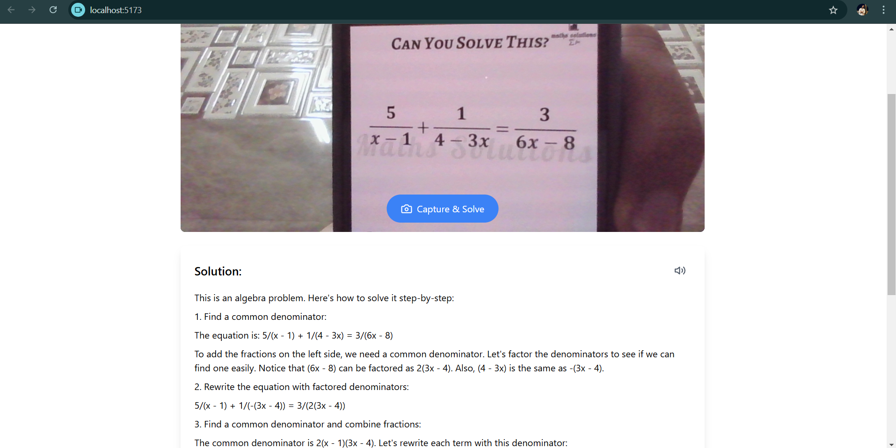
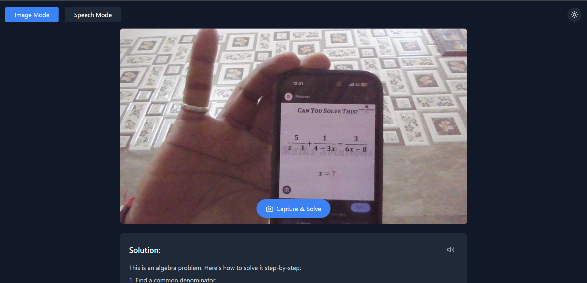
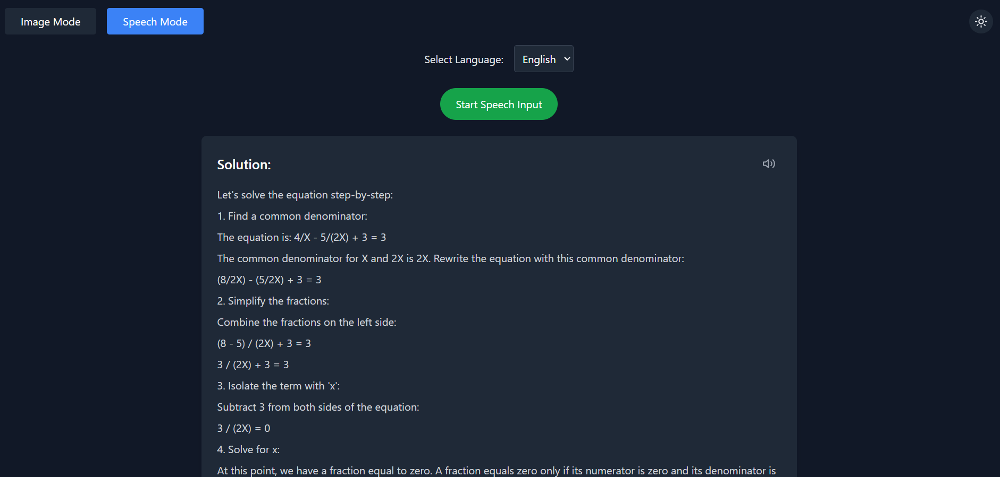
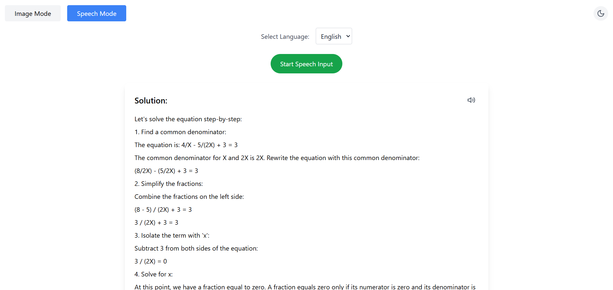

# AI Problem Solver

**AI Problem Solver** is an interactive tool designed to help students and learners solve academic problems using advanced AI. It supports both image-based and speech-based input, utilizing the power of Google Gemini AI to analyze and solve various types of academic problems. The app provides real-time solutions and explanations, making learning more accessible and engaging.

## Live Demo
You can view the live version of the app by clicking the link below:

[**Live Demo - Learning Assistant**](https://learning-assistant-eta.vercel.app/)

## Features
- **Image Mode**: Capture an image of a problem (e.g., math or science questions) using your device's camera and get a detailed solution.
- **Speech Mode**: Speak your academic query, and the AI will process it to provide a solution in real-time.
- **Theme Toggle**: Switch between light and dark modes to personalize your experience.
- **AI-Powered Solutions**: Powered by Google Gemini AI, which provides detailed, step-by-step solutions for various types of academic queries.

## Technologies Used
- **React**: Frontend framework for building the UI.
- **Tailwind CSS**: Utility-first CSS framework for styling the components.
- **Google Gemini AI**: Used for analyzing images and text to provide academic solutions.
- **Speech Synthesis API**: Converts the text-based solution into speech for accessibility.
- **Webcam**: Captures images for image-based mode.
- **TypeScript**: For type safety and better maintainability.

## Setup Instructions

To get started with **Learning Assistant**, follow the steps below:

### Prerequisites
Make sure you have the following installed:
- [Node.js](https://nodejs.org/) (version >= 16)
- [npm](https://www.npmjs.com/) (Node Package Manager)

### 1. Clone the repository
Clone the repository to your local machine using:

```bash
git clone https://github.com/DevyanshMalhotra/Learning-assistant.git
```

### 2. Install dependencies
Navigate to the project directory and install the required dependencies:

```bash
cd learning-assistant
npm install
```

### 3. Set up environment variables
Make sure you have an API key from Google Gemini AI. Create a `.env` file in the root of your project and add the following:

```bash
REACT_APP_GEMINI_API_KEY=your-api-key
```

You can obtain an API key by signing up for Google Gemini AI or through your Google Cloud console.

### 4. Start the development server
To run the app locally, use the following command:

```bash
npm run dev
```

This will start the development server, and you can view the app at `http://localhost:5173` in your browser.

### 5. Build the app for production
If you want to build the app for production use, run:

```bash
npm run build
```

This will create an optimized build of your app in the `build` folder.

## Features Explained

### 1. **Image Mode**
In the Image Mode, you can capture a problem using your webcam or any image source. The app will send the image to the Gemini AI API for analysis. If the image contains an academic problem, the AI will return a detailed solution. If not, it will notify the user that the image does not contain a recognizable academic problem.

### 2. **Speech Mode**
In Speech Mode, you can speak your academic query. The app uses the browser's speech recognition API to capture your speech and converts it to text. The text is then processed using Gemini AI to provide a solution. The solution can be read aloud using the speech synthesis API, enhancing accessibility.

### 3. **Theme Toggle**
The app includes a theme toggle feature, allowing users to switch between light and dark themes. The theme preference is saved in `localStorage` so that the chosen theme persists across sessions.

### 4. **Solution Display**
Once a solution is generated, it is displayed in a user-friendly format. For each solution, the user can choose to have the solution read aloud using the text-to-speech functionality. This makes the solution more interactive and accessible.

## Test Images

Here are some test images used in this project:









## Known Issues
- **Speech Recognition Accuracy**: The accuracy of speech recognition may vary depending on the quality of the microphone and ambient noise.
- **API Limitations**: The solution quality depends on the data returned by Gemini AI. Sometimes, it may not be able to solve the problem accurately.

## License
This project is open-source and available under the [MIT License](LICENSE).

## Contact
For any queries, please reach out to [devyanshmalhotra28@gmail.com](mailto:devyanshmalhotra28@gmail.com).

